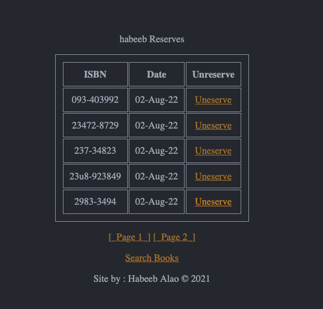

# Book-Reservation-System
Book Reservation system which uses html, php and sql to access and reserve books from external database hosted using XAMPP

## Login Validation 


```php
if ($value == "CheckLoginDetails") {

    $username_ = $conn->real_escape_string($_POST['UserName']);
    $password = $conn->real_escape_string($_POST['Password']);

    $sql = "SELECT Username, Password FROM Users WHERE (Username = '$username_' and Password = '$password');";

    $result = $conn->query($sql);


    if ($result->num_rows > 0) {

        setcookie("user", $username_);
        header('Location: /WebD/GradedLab/SearchBookPage.php?');
    } else {
        echo "no match found";
        header('Location: /WebD/GradedLab/index.php?error=NotFound');
    }
}
```

## Creating an account

Regiter Account.

```php
elseif ($value == "RegisterAccount") {


    $username = $conn->real_escape_string($_POST['UserName']);
    $password = $conn->real_escape_string($_POST['Password']);
    $firstname = $conn->real_escape_string($_POST['FirstName']);
    $surename = $conn->real_escape_string($_POST['Surname']);
    $addressLine1 = $conn->real_escape_string($_POST['AddressLine1']);
    $addressLine2 = $conn->real_escape_string($_POST['AddressLine2']);
    $City = $conn->real_escape_string($_POST['City']);
    $Telephone = $conn->real_escape_string($_POST['Telephone']);
    $Mobile = $conn->real_escape_string($_POST['Mobile']);


    if (isset($_POST['UserName']) && (isset($_POST['Password']) && (strlen($_POST['Password']) == 6)) && isset($_POST['FirstName']) && isset($_POST['Surname']) && isset($_POST['AddressLine1']) && isset($_POST['AddressLine2']) && isset($_POST['City']) && (isset($_POST['Telephone']) && strlen($_POST['Telephone']) == 10) && (isset($_POST['Mobile']) && strlen($_POST['Mobile']) == 10)) {
        echo "success";


        $sql = "INSERT INTO Users VALUES ('$username','$password','$firstname','$surename','$addressLine1','$addressLine2','$City','$Telephone','$Mobile');";
        $result = $conn->query($sql);

        header('Location: /WebD/GradedLab/index.php?succ=set');
    } else {
        if (strlen($_POST['Password']) == 6) {
            header('Location: /WebD/GradedLab/RegisterPage.php?error_len=set');
        }
        header('Location: /WebD/GradedLab/RegisterPage.php?error_missingfields=set');
    }
}
```

## Viewing Reserved books with Pagination in php

view accounts reserved books.




```php
elseif ($value == "SeeReserves") {
    include 'header.php';

    $user = $_COOKIE["user"];

    // NUMBER OF RESULTS PERPAGE
    $results_per_page = 5;

    if ($_COOKIE['user'] !== "null") {

        echo "<P>" . "$user" . " Reserves </p>";


        $sql = "SELECT * FROM Reservations WHERE (Username = '$user');";


        $result = mysqli_query($conn, $sql);

        // finds out the number of results 
        $number_of_results = mysqli_num_rows($result);


        // finds out the total pages available
        $number_of_pages = ceil($number_of_results / $results_per_page);


        // determine what page user is currently on
        if (!isset($_GET['page'])) {
            $page = 1;
        } else {
            $page = $_GET['page'];
        }

        //determine the sql limit starting number
        $this_page_first_result = ($page - 1) * $results_per_page;

        $sql = "SELECT ISBN, ReservedDate, Username FROM Reservations WHERE (Username = '$user')  LIMIT " . $this_page_first_result . "," . $results_per_page . " ; ";

        $result = mysqli_query($conn, $sql);

        if ($result->num_rows > 0) {

            echo "<table = 1>"; // start a table tag in the HTML

            echo "<tr><th>ISBN</th><th>Date</th><th>Unreserve</th></tr>"; // columns 

            while ($row = $result->fetch_assoc()) {   // Creates a loop to loop through results
                echo "<tr><td>" . $row['ISBN'] . "</td><td>" . $row['ReservedDate'] . "</td><td>" . "<a href=\"" . "unreserve.php?value=" . $row["ISBN"] . "\" >Uneserve </a></td></tr>";
            }
            echo "</table>";
            echo '<p>';
            for ($page = 1; $page < $number_of_pages + 1; $page++) {
                echo ' <a href="site.php?&value=SeeReserves&page=' . $page . '">[_Page ' . $page . '_]' . '</a>';
            }
        } else {
            echo "<p>You haven't got any reserved books</p>";
        }


        echo "<p><a href =\"SearchBookPage.php?\"> Search Books </a></p>";
    } else {
        header('Location: /WebD/GradedLab/index.php?log=out"');
    }
}
```